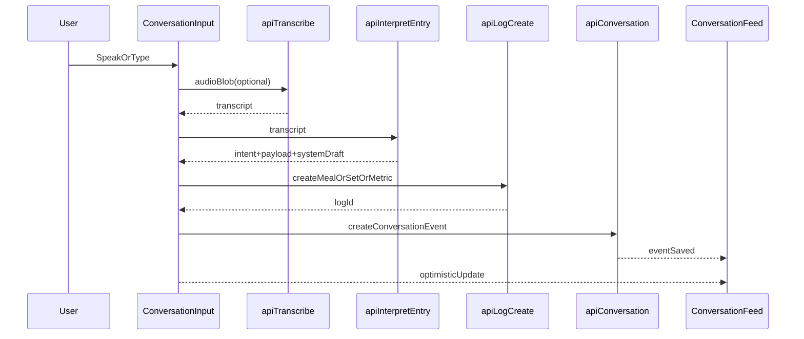

# Health App Redesign Plan

## Design System + Global Layout

- Update typography and theme defaults to match the mock: swap fonts in [`app/layout.tsx`](/Users/smamadapur/Desktop/Learning/web/personal-tracker/app/layout.tsx) to `DM Sans` (body) + `Instrument Serif` (display), and add a `ThemeProvider` to default the app to dark mode.
- Rework CSS tokens and animations in [`app/globals.css`](/Users/smamadapur/Desktop/Learning/web/personal-tracker/app/globals.css) to the new dark palette (bg layers, text, borders, accent category colors), plus ambient glow + recording animations (pulse/waves) modeled on [`health-app-redesign.html`](/Users/smamadapur/Desktop/Learning/web/personal-tracker/health-app-redesign.html).
- Reskin shared UI primitives (buttons/cards/badges/inputs) as needed in [`components/ui`](/Users/smamadapur/Desktop/Learning/web/personal-tracker/components/ui) to reduce visual noise and align with the new depth/glow styles.
- Replace or restyle the bottom navigation to avoid conflict with the new hero input (update [`components/bottom-nav.tsx`](/Users/smamadapur/Desktop/Learning/web/personal-tracker/components/bottom-nav.tsx) or introduce a new “dock” style nav used across logged-in pages).

## Data Model + API for Conversational Logging

- Add a persistent conversation model in [`prisma/schema.prisma`](/Users/smamadapur/Desktop/Learning/web/personal-tracker/prisma/schema.prisma) (e.g., `ConversationEvent` with `userId`, `kind`, `userText`, `systemText`, `source`, `referenceType`, `referenceId`, `metadata`, `createdAt`), update types in [`lib/types.ts`](/Users/smamadapur/Desktop/Learning/web/personal-tracker/lib/types.ts), and create a migration.
- Create a new endpoint to list/store conversation events in [`app/api/conversation/route.ts`](/Users/smamadapur/Desktop/Learning/web/personal-tracker/app/api/conversation/route.ts) with pagination and filters for the feed.
- Implement a unified intent router endpoint (e.g., [`app/api/interpret/entry/route.ts`](/Users/smamadapur/Desktop/Learning/web/personal-tracker/app/api/interpret/entry/route.ts)) that:
  - Uses Gemini to classify intent (`meal`, `workout_set`, `weight`, `steps`, `question`) and extract structured payloads.
  - For `meal`/`workout_set`, reuses existing interpretation logic or invokes those handlers to keep parsing consistent.
  - For `question`, fetches recent meals/metrics/workouts and generates a concise answer.
- Define a “quick log” workout session strategy for intent‑based workout entries (auto-create or reuse a same‑day session) so the unified input can log sets without manual session setup.
- Hook conversation creation into existing write paths ([`app/api/meals/route.ts`](/Users/smamadapur/Desktop/Learning/web/personal-tracker/app/api/meals/route.ts), [`app/api/workout-sets/route.ts`](/Users/smamadapur/Desktop/Learning/web/personal-tracker/app/api/workout-sets/route.ts), [`app/api/daily-metrics/route.ts`](/Users/smamadapur/Desktop/Learning/web/personal-tracker/app/api/daily-metrics/route.ts)) so logs from any entry point also appear in the feed.
- Add a one-time backfill script or endpoint to generate conversation events for existing logs (meals, workout sets, weight/steps) so the feed isn’t empty for current users.

## Core UI Components (Conversational UX)

- Build a new `ConversationInput` with adaptive placeholder, suggestion chips, and voice recording state (new file in [`components`](/Users/smamadapur/Desktop/Learning/web/personal-tracker/components)), reusing [`hooks/use-voice-recorder.ts`](/Users/smamadapur/Desktop/Learning/web/personal-tracker/hooks/use-voice-recorder.ts) and the `/api/transcribe` flow.
- Create `ConversationFeed` / `ConversationItem` components (new files in [`components`](/Users/smamadapur/Desktop/Learning/web/personal-tracker/components)) that render user + system messages, category coloring, timestamps, and “pending/failed” states.
- Update interpretation dialogs ([`components/meal-interpretation-dialog.tsx`](/Users/smamadapur/Desktop/Learning/web/personal-tracker/components/meal-interpretation-dialog.tsx), [`components/workout-set-interpretation-dialog.tsx`](/Users/smamadapur/Desktop/Learning/web/personal-tracker/components/workout-set-interpretation-dialog.tsx)) or add a lightweight metric confirmation dialog to keep the conversational flow while still allowing edits.

## Page‑Level Redesigns (All Screens)

- **Dashboard**: replace the quick actions block in [`app/dashboard/page.tsx`](/Users/smamadapur/Desktop/Learning/web/personal-tracker/app/dashboard/page.tsx) with the new feed + input, and restyle the summary/trends to match the mock (update [`components/today-summary-card.tsx`](/Users/smamadapur/Desktop/Learning/web/personal-tracker/components/today-summary-card.tsx) and [`components/weekly-trends-card.tsx`](/Users/smamadapur/Desktop/Learning/web/personal-tracker/components/weekly-trends-card.tsx)).
- **Meals/Workouts/Metrics/Settings**: update layouts + headers to the new dark aesthetic and typography in [`app/meals/page.tsx`](/Users/smamadapur/Desktop/Learning/web/personal-tracker/app/meals/page.tsx), [`app/workouts/page.tsx`](/Users/smamadapur/Desktop/Learning/web/personal-tracker/app/workouts/page.tsx), `[app/workouts/[id]/page.tsx](/Users/smamadapur/Desktop/Learning/web/personal-tracker/app/workouts/[id]/page.tsx)`, [`app/metrics/page.tsx`](/Users/smamadapur/Desktop/Learning/web/personal-tracker/app/metrics/page.tsx), [`app/settings/page.tsx`](/Users/smamadapur/Desktop/Learning/web/personal-tracker/app/settings/page.tsx) and ensure the new navigation + optional input bar doesn’t obstruct forms.
- **Landing/Auth**: restyle [`app/page.tsx`](/Users/smamadapur/Desktop/Learning/web/personal-tracker/app/page.tsx) and the Clerk wrappers (`[app/sign-in/[[...sign-in]]/page.tsx](/Users/smamadapur/Desktop/Learning/web/personal-tracker/app/sign-in/[[...sign-in]]/page.tsx)`, `[app/sign-up/[[...sign-up]]/page.tsx](/Users/smamadapur/Desktop/Learning/web/personal-tracker/app/sign-up/[[...sign-up]]/page.tsx)`) to match the new dark, modern aesthetic and typography.

## Data Flow (Mermaid)

## Validation + QA

- Validate end‑to‑end flows: text + voice logging for each intent, question answering, and conversation feed persistence.
- Verify layout spacing so the fixed input bar and navigation never overlap content.
- Confirm new dark theme and typography across all pages and Clerk screens.