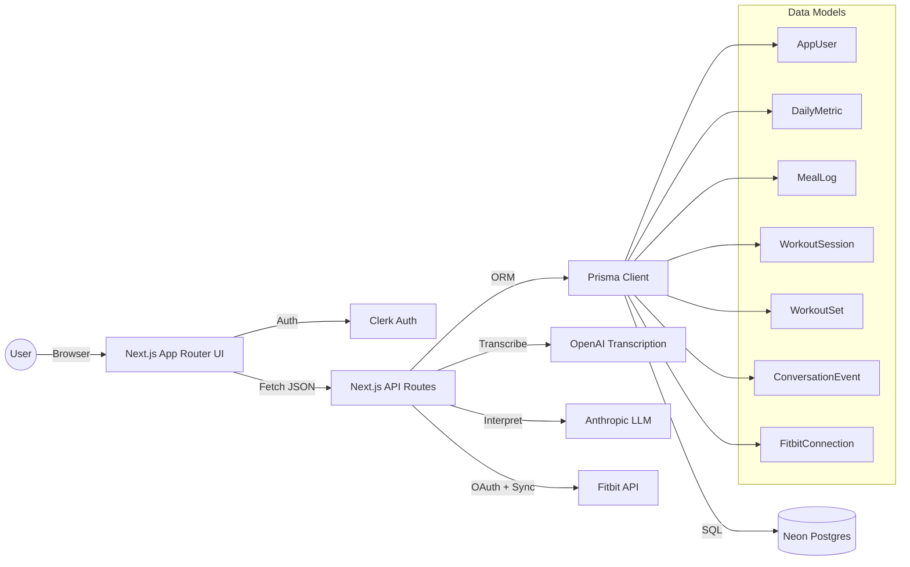
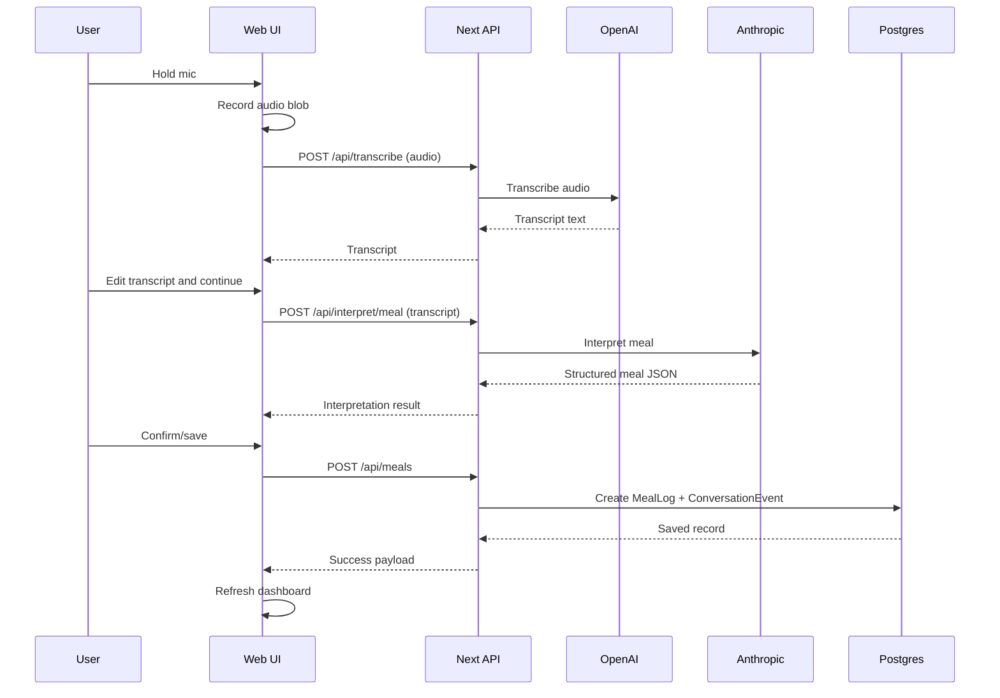

# Voicefit Mobile Spec and Build Plan

## 1. Purpose
Define everything needed to build the Voicefit mobile app as a separate Expo React Native project, reuse the current Next.js API, and reach feature parity with web in phases.

## 2. Context and Constraints
1. Separate repos only. No monorepo.
2. Mobile should reach parity, then web can be sunset.
3. MVP should be voice meals + manual steps/weight.
4. Native-first UI (not a pixel match to web).
5. Shared API contracts must be centralized (GitHub Packages).

## 3. Current System Summary (Web)
1. Frontend: Next.js App Router, Clerk auth, Tailwind + shadcn.
2. Backend: Next.js API routes with Prisma + Neon Postgres.
3. Voice pipeline:
   - `POST /api/transcribe` (OpenAI)
   - `POST /api/interpret/meal` and `POST /api/interpret/workout-set` (Anthropic)
4. Data model: AppUser, DailyMetric, MealLog, WorkoutSession, WorkoutSet, ConversationEvent, FitbitConnection.
5. Conversation feed is stored and generated for logs.
6. Fitbit OAuth + sync exists for steps (web only today).

## 4. Current Architecture Diagram (Component View)

## 5. Current Architecture Diagram (Voice Meal Flow)

## 6. Mobile Target Architecture (Summary)
1. Expo React Native app (separate repo).
2. Clerk Expo SDK for auth.
3. API client with bearer token to existing Next.js API.
4. Shared Zod + types package `@voicefit/contracts`.

## 7. Shared Contracts Package
1. New repo: `voicefit-contracts`.
2. Publish to GitHub Packages as `@voicefit/contracts`.
3. Content:
   - Zod schemas (validations)
   - Shared types (DashboardData, MealInterpretation, etc.)
   - API response type `{ success, data, error }`
4. Web and mobile import from this package.

## 8. API Inventory (Current)
1. Auth and User
   - `GET /api/user/settings`
   - `PUT /api/user/settings`
2. Dashboard
   - `GET /api/dashboard?timezone=...&date=YYYY-MM-DD`
3. Meals
   - `GET /api/meals`
   - `POST /api/meals`
   - `GET /api/meals/recent`
   - `PUT /api/meals/:id`
   - `DELETE /api/meals/:id`
4. Daily metrics
   - `GET /api/daily-metrics/:date`
   - `PUT /api/daily-metrics/:date`
   - `DELETE /api/daily-metrics/:date`
5. Workouts
   - `GET /api/workout-sessions`
   - `POST /api/workout-sessions`
   - `GET /api/workout-sessions/:id`
   - `PUT /api/workout-sessions/:id`
   - `DELETE /api/workout-sessions/:id`
   - `POST /api/workout-sets`
   - `PUT /api/workout-sets/:id`
   - `DELETE /api/workout-sets/:id`
6. Voice and LLM
   - `POST /api/transcribe`
   - `POST /api/interpret/meal`
   - `POST /api/interpret/workout-set`
   - `POST /api/interpret/entry`
7. Conversation feed
   - `GET /api/conversation`
   - `POST /api/conversation/backfill`
8. Fitbit
   - `GET /api/fitbit/status`
   - `GET /api/fitbit/connect`
   - `GET /api/fitbit/callback`
   - `POST /api/fitbit/sync`
   - `POST /api/fitbit/disconnect`

## 9. Mobile MVP Feature Requirements
1. Auth: sign in/out using Clerk.
2. Dashboard:
   - Today summary
   - Recent meals list
3. Voice meal logging:
   - Record audio
   - Transcribe
   - Edit transcript
   - Interpret
   - Review and save
4. Manual steps + weight:
   - Form inputs
   - Upsert daily metric
5. Settings:
   - Show goal values
   - Update calorie and step goals

## 10. Decisions Locked
1. Repo separation: `voicefit` (web) and `voicefit-mobile` (Expo).
2. Backend: reuse Next.js API, no new service.
3. Auth: Clerk bearer token for mobile.
4. UI: native-first components, no web UI porting.
5. State: React Query for API caching.
6. Forms: react-hook-form + zod.
7. Audio: expo-av recording, upload as `FormData`.
8. Charts: deferred to parity phase.

## 11. Phase Plan With Task-Level Definitions

### Phase 0 — Prep and Contracts
1. Task: Create contracts repo
   - Scope: Set up `voicefit-contracts` with TypeScript build.
   - Done: Package published to GitHub Packages and installable.
2. Task: Move schemas and types
   - Scope: Migrate `lib/validations.ts` and `lib/types.ts` content to contracts package.
   - Done: Web builds using `@voicefit/contracts` imports.
3. Task: Versioning policy
   - Scope: Define semver and publish workflow.
   - Done: README with release steps.

### Phase 1 — Backend Mobile Auth Support
1. Task: Add bearer token auth
   - Scope: New helper `getCurrentUserFromRequest(request)` to support cookies and bearer.
   - Done: All API routes use the new helper.
2. Task: Auth test endpoint
   - Scope: Add a lightweight `GET /api/user/settings` validation in mobile client.
   - Done: Mobile can call with bearer token successfully.
3. Task: Response schema alignment
   - Scope: Ensure `{ success, data, error }` format is consistent.
   - Done: All MVP endpoints return uniform response shape.

### Phase 2 — Mobile App Foundation
1. Task: Expo app bootstrap
   - Scope: Create `voicefit-mobile` using Expo + TypeScript.
   - Done: App builds on iOS and Android simulators.
2. Task: Navigation
   - Scope: expo-router with tabs and stack modals.
   - Done: Tabs for Dashboard, Log, Meals, Settings.
3. Task: Clerk auth integration
   - Scope: `@clerk/clerk-expo` configured with deep linking.
   - Done: Sign in, sign out, persistent session.
4. Task: API client
   - Scope: Central `apiClient.ts` with bearer token, error handling, and Zod validation.
   - Done: Typed client used by all screens.
5. Task: Theming and base components
   - Scope: Base typography, colors, spacing tokens.
   - Done: Consistent UI primitives for buttons, cards, inputs.

### Phase 3 — MVP Features
1. Task: Dashboard screen
   - Scope: Fetch `GET /api/dashboard`, show today summary + recent meals.
   - Done: Visible data with loading and error states.
2. Task: Voice recording
   - Scope: `expo-av` record, press-and-hold button, min duration guard.
   - Done: Audio file produced with correct MIME type.
3. Task: Transcription
   - Scope: Upload audio to `/api/transcribe` with FormData.
   - Done: Transcript received and shown in editable screen.
4. Task: Interpretation
   - Scope: Call `/api/interpret/meal`.
   - Done: Structured meal shown in review screen.
5. Task: Save meal
   - Scope: `POST /api/meals`.
   - Done: Meal saved, dashboard refreshed.
6. Task: Manual metrics
   - Scope: Form input for steps and weight, `PUT /api/daily-metrics/:date`.
   - Done: Dashboard shows updated values.
7. Task: Settings goals
   - Scope: `GET/PUT /api/user/settings`.
   - Done: Update goals in mobile.

### Phase 4 — Parity Features
1. Task: Workouts
   - Scope: Sessions list, session details, add sets by voice.
   - Done: Full parity with web workouts.
2. Task: Edit and delete flows
   - Scope: Meals, workouts, sets, daily metrics.
   - Done: CRUD parity.
3. Task: Weekly trends
   - Scope: Charts for calories, steps, weight, workouts.
   - Done: Graphs rendered natively.
4. Task: Conversation feed
   - Scope: Show conversation events and quick log entry.
   - Done: Feed parity.
5. Task: Fitbit integration
   - Scope: OAuth and sync in mobile.
   - Done: Steps can sync from Fitbit.

### Phase 5 — Web Sunset
1. Task: Parity checklist
   - Scope: Validate all web features in mobile.
   - Done: Parity signoff doc.
2. Task: Sunset plan
   - Scope: Redirect web users to app, read-only web mode.
   - Done: Decommission plan approved.

## 12. Definition of Done for MVP
1. User can sign in on mobile.
2. Voice meal logging works end to end.
3. Manual steps and weight are saved and visible on dashboard.
4. Settings goals can be updated.
5. Mobile runs on iOS and Android.

## 13. Risks and Mitigations
1. Audio encoding differences
   - Mitigation: enforce `m4a` or `aac` and validate server accepts.
2. Token validation failures
   - Mitigation: add explicit mobile auth helper and test endpoint.
3. Schema drift
   - Mitigation: `@voicefit/contracts` is mandatory for both repos.

## 14. Environment Variables (Mobile)
1. `EXPO_PUBLIC_API_BASE_URL`
2. `EXPO_PUBLIC_CLERK_PUBLISHABLE_KEY`

## 15. Non-Goals
1. Offline mode
2. PWA or web UI reuse
3. Advanced nutrition or device integrations in MVP
