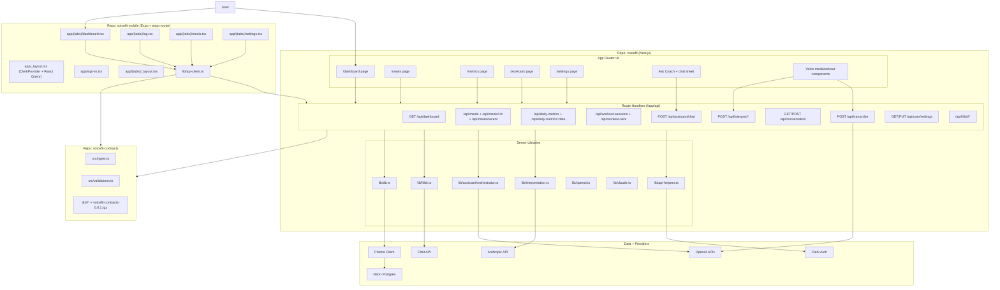
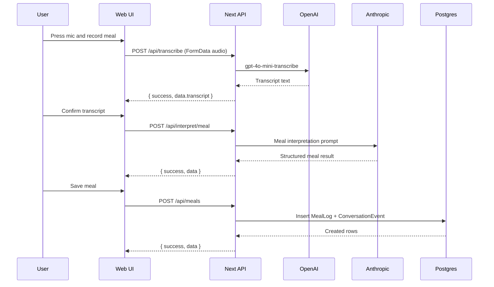
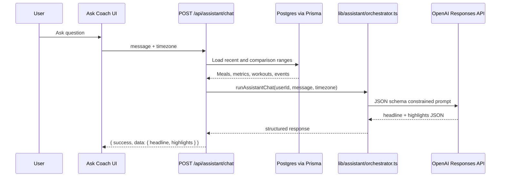
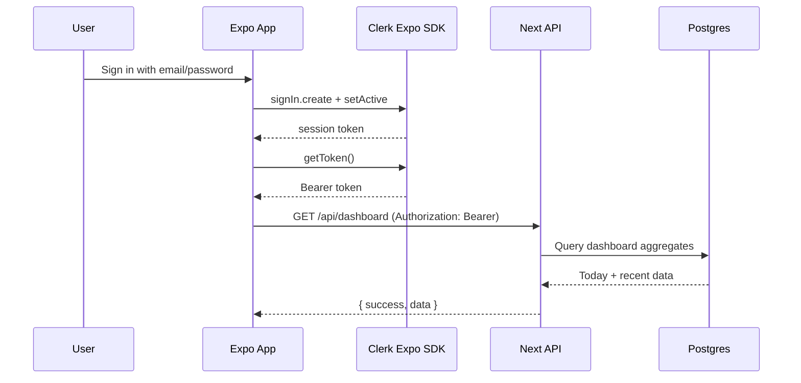

# Voicefit Mobile Parity Spec (Blind Agent Handoff)

## 0. Document Control
- Last updated: 2026-02-10
- Purpose: Single source of truth for continuing mobile build work in a new chat with a blind coding agent.
- Workspace root: `/Users/samarth/Desktop/Work/voicefit-all`
- Repositories:
  - Web app: `/Users/samarth/Desktop/Work/voicefit-all/voicefit`
  - Mobile app: `/Users/samarth/Desktop/Work/voicefit-all/voicefit-mobile`
  - Contracts package: `/Users/samarth/Desktop/Work/voicefit-all/voicefit-contracts`
- UI source-of-truth index (prototypes/assets/interaction specs): `/Users/samarth/Desktop/Work/voicefit-all/voicefit-mobile/prototypes/spec-ui-source-of-truth.md`

## 1. Locked Product Decisions
1. Web and mobile stay in separate repos. No monorepo migration.
2. Web sunset is allowed only after mobile reaches both functional parity and stakeholder-approved UI/UX parity.
3. Backend remains the existing Next.js API in `voicefit`. No new backend service.
4. Mobile auth uses Clerk bearer tokens.
5. Shared types and Zod schemas come from `@voicefit/contracts`.
6. Mobile UX is native-first, but visual quality and interaction polish must be at stakeholder-approved parity before sunset.
7. Mobile health sync direction is Apple HealthKit (iOS) + Health Connect (Android); mobile Fitbit API flows are deprecated.

## 2. Current Repo Snapshot (Important)
This section is intentionally explicit so a blind agent can trust current state before coding.

### 2.1 `voicefit` (web + backend)
- Path: `/Users/samarth/Desktop/Work/voicefit-all/voicefit`
- Branch: `master`
- Commit: `441d28f`
- Working tree: dirty
- Modified files (do not discard):
  - `app/api/interpret/entry/route.ts`
  - `app/api/interpret/meal/route.ts`
  - `app/api/interpret/workout-set/route.ts`
  - `app/api/transcribe/route.ts`
  - `bun.lock`
  - `lib/api-helpers.ts`
  - `lib/types.ts`
  - `lib/validations.ts`
  - `next.config.ts`
  - `package.json`
  - `spec-mobile.md`

### 2.2 `voicefit-mobile` (Expo app)
- Path: `/Users/samarth/Desktop/Work/voicefit-all/voicefit-mobile`
- Branch: `main`
- Commit: `946d8a0`
- Working tree: clean

### 2.3 `voicefit-contracts` (shared package)
- Path: `/Users/samarth/Desktop/Work/voicefit-all/voicefit-contracts`
- Branch: `main`
- Commit: `ec6cad6`
- Working tree: dirty (untracked `bun.lock`)

## 3. Architecture Overview (Current)

### 3.1 System Component Diagram


### 3.2 Voice Meal Flow (Current Web)


### 3.3 Assistant Chat Flow (Current Web)


### 3.4 Mobile Auth + Dashboard Flow (Current Scaffold)


## 4. Current API Inventory
All routes discovered under `/Users/samarth/Desktop/Work/voicefit-all/voicefit/app/api`.

### 4.1 Auth/User
- `GET /api/user/settings`
- `PUT /api/user/settings`

### 4.2 Dashboard
- `GET /api/dashboard`

### 4.3 Meals
- `GET /api/meals`
- `POST /api/meals`
- `GET /api/meals/recent`
- `GET /api/meals/:id`
- `PUT /api/meals/:id`
- `DELETE /api/meals/:id`

### 4.4 Daily Metrics
- `GET /api/daily-metrics`
- `POST /api/daily-metrics`
- `GET /api/daily-metrics/:date`
- `PUT /api/daily-metrics/:date`
- `DELETE /api/daily-metrics/:date`

### 4.5 Workouts
- `GET /api/workout-sessions`
- `POST /api/workout-sessions`
- `POST /api/workout-sessions/quick`
- `GET /api/workout-sessions/:id`
- `PUT /api/workout-sessions/:id`
- `DELETE /api/workout-sessions/:id`
- `POST /api/workout-sets`
- `GET /api/workout-sets`
- `PUT /api/workout-sets/:id`
- `DELETE /api/workout-sets/:id`

### 4.6 Voice + Interpretation
- `POST /api/transcribe`
- `POST /api/interpret/meal`
- `POST /api/interpret/workout-set`
- `POST /api/interpret/entry`

### 4.7 Conversation + Assistant
- `GET /api/conversation`
- `POST /api/conversation`
- `POST /api/conversation/backfill`
- `POST /api/assistant/chat`

### 4.8 Fitbit
- `GET /api/fitbit/status`
- `GET /api/fitbit/connect`
- `GET /api/fitbit/callback`
- `GET /api/fitbit/sync`
- `POST /api/fitbit/disconnect`

## 5. Auth Architecture and Correct Integration Pattern

### 5.1 Server behavior (already implemented)
- Helper: `getCurrentUser(request?: NextRequest)` in `/Users/samarth/Desktop/Work/voicefit-all/voicefit/lib/api-helpers.ts`.
- It supports:
  - Bearer token via `Authorization` header and Clerk `verifyToken`.
  - Fallback to Clerk cookie/session via `auth()`.
- Important correction: helper name is `getCurrentUser`, not `getCurrentUserFromRequest`.

### 5.2 Mobile pattern (correct hook usage)
Do not call `useAuth()` inside plain utility functions.

```ts
import { useAuth } from "@clerk/clerk-expo";
import { useQuery } from "@tanstack/react-query";
import type { DashboardData } from "@voicefit/contracts/types";
import { apiRequest } from "../lib/api-client";

export function useDashboardQuery() {
  const { getToken } = useAuth();
  const timezone = Intl.DateTimeFormat().resolvedOptions().timeZone;

  return useQuery<DashboardData>({
    queryKey: ["dashboard", timezone],
    queryFn: async () => {
      const token = await getToken();
      if (!token) throw new Error("Not signed in");
      return apiRequest<DashboardData>(
        `/api/dashboard?timezone=${encodeURIComponent(timezone)}`,
        { token }
      );
    },
  });
}
```

## 6. Contracts Package State

### 6.1 Current reality
- Package exists locally in `/Users/samarth/Desktop/Work/voicefit-all/voicefit-contracts`.
- Tarball exists: `/Users/samarth/Desktop/Work/voicefit-all/voicefit-contracts/voicefit-contracts-0.0.1.tgz`.
- Web and mobile currently consume the tarball with:
  - `"@voicefit/contracts": "file:../voicefit-contracts/voicefit-contracts-0.0.1.tgz"`
- Publishing to GitHub Packages is configured but not yet operationally documented as completed.

### 6.2 Decision
- Continue local tarball until parity MVP is stable.
- Publish workflow to GitHub Packages is a later hardening task (defined in Phase 0 task list below).

## 7. Mobile App Current State (Ground Truth)

### 7.1 Implemented
- Expo Router app skeleton with tabs and auth guard.
- Clerk provider and secure token cache in `app/_layout.tsx`.
- Sign-in screen with email/password in `app/sign-in.tsx`.
- Dashboard screen fetches backend data with bearer token in `app/(tabs)/dashboard.tsx`.
- Shared API helper in `lib/api-client.ts`.

### 7.2 Still placeholder
- `app/(tabs)/log.tsx`
- `app/(tabs)/meals.tsx`
- `app/(tabs)/settings.tsx` (only sign-out currently)

## 8. Environment Requirements

### 8.1 Web/backend (`voicefit`)
Required env keys used by code:
- `DATABASE_URL`
- `CLERK_SECRET_KEY`
- `OPENAI_API_KEY`
- `ANTHROPIC_API_KEY`
- `FITBIT_CLIENT_ID`
- `FITBIT_CLIENT_SECRET`
- `FITBIT_REDIRECT_URI`

### 8.2 Mobile (`voicefit-mobile`)
- `EXPO_PUBLIC_CLERK_PUBLISHABLE_KEY`
- `EXPO_PUBLIC_API_BASE_URL`

Notes:
- `EXPO_PUBLIC_API_BASE_URL` must be reachable by physical devices.
- iOS simulator requires working Xcode command line tools (`xcrun simctl` available).

## 9. Phase Plan With Task-Level Scope
Status values are strict:
- `Not Started`
- `In Progress`
- `Done`
- `Blocked`

A task can move to `Done` only when all exit criteria and validation commands pass.

---

## Phase 0: Foundation and Package Hygiene

### P0-T1: Contracts repo hardening
- Status: `In Progress`
- Goal: Make `@voicefit/contracts` safe for repeated consumption.
- In scope:
  - Keep `src/types.ts`, `src/validations.ts`, `src/index.ts` coherent.
  - Ensure `npm pack` output includes all required dist files.
- Out of scope:
  - Full semantic-release automation.
- Exit criteria:
  - `bun run build` passes in `voicefit-contracts`.
  - `npm pack` creates tarball that installs in both web and mobile.
- Validation commands:
  - `cd /Users/samarth/Desktop/Work/voicefit-all/voicefit-contracts && bun run build`
  - `cd /Users/samarth/Desktop/Work/voicefit-all/voicefit-contracts && npm pack`

### P0-T2: Contracts publish pipeline (GitHub Packages)
- Status: `Not Started`
- Goal: Add explicit publish documentation and command sequence.
- In scope:
  - README section for auth token setup and publish command.
  - Pin package name/version workflow.
- Out of scope:
  - CI release bot.
- Exit criteria:
  - Human can publish a new version without guessing steps.
- Validation commands:
  - `npm whoami --registry=https://npm.pkg.github.com`
  - `npm publish --registry=https://npm.pkg.github.com`

---

## Phase 1: Backend Mobile Compatibility

### P1-T1: Bearer auth coverage audit
- Status: `Done`
- Goal: Ensure all mobile-called routes are bearer-token safe.
- In scope:
  - Verify all MVP routes work with `Authorization: Bearer`.
  - Standardize route handlers to call `getCurrentUser(request)` where feasible.
- Out of scope:
  - Rewriting non-MVP route internals.
- Exit criteria:
  - MVP endpoints succeed with bearer token in curl/manual tests.
- Validation commands:
  - `curl -H "Authorization: Bearer <token>" "<api>/api/dashboard?timezone=UTC"`
  - `curl -X POST -H "Authorization: Bearer <token>" -H "Content-Type: application/json" "<api>/api/interpret/meal" -d '{"transcript":"2 eggs","mealType":"breakfast"}'`
- Evidence:
  - Bearer request-path standardization in:
    - `/Users/samarth/Desktop/Work/voicefit-all/voicefit/app/api/dashboard/route.ts`
    - `/Users/samarth/Desktop/Work/voicefit-all/voicefit/app/api/meals/route.ts`
    - `/Users/samarth/Desktop/Work/voicefit-all/voicefit/app/api/user/settings/route.ts`
    - `/Users/samarth/Desktop/Work/voicefit-all/voicefit/app/api/daily-metrics/route.ts`
    - `/Users/samarth/Desktop/Work/voicefit-all/voicefit/app/api/daily-metrics/[date]/route.ts`
  - Curl outputs captured:
    - `/tmp/p1_t1_dashboard.txt` (`200`, `success: true`)
    - `/tmp/p1_t1_interpret_meal.txt` (`500`)
    - `/tmp/p1_t1_settings_get.txt` (`200`, `success: true`)
    - `/tmp/p1_t1_settings_put.txt` (`200`, `success: true`)
    - `/tmp/p1_t1_daily_post.txt` (`200`, `success: true`)
    - `/tmp/p1_t1_meals_post.txt` (`201`, `success: true`)
    - `/tmp/p1_t1_dashboard_after_key.txt` (`200`, `success: true`)
    - `/tmp/p1_t1_interpret_meal_after_key.txt` (`200`, `success: true`)
- Validation commands run:
  - `cd /Users/samarth/Desktop/Work/voicefit-all/voicefit && bun run build`
  - `cd /Users/samarth/Desktop/Work/voicefit-all/voicefit && bun run dev` (manual curl against `http://localhost:3000`)
  - `cd /Users/samarth/Desktop/Work/voicefit-all/voicefit && set -a && source .env && set +a && TOKEN=$(bun -e '...createClerkClient...sessions.getToken...') && curl -H "Authorization: Bearer $TOKEN" "http://localhost:3000/api/dashboard?timezone=UTC"`
  - `cd /Users/samarth/Desktop/Work/voicefit-all/voicefit && set -a && source .env && set +a && TOKEN=$(bun -e '...createClerkClient...sessions.getToken...') && curl -X POST -H "Authorization: Bearer $TOKEN" -H "Content-Type: application/json" "http://localhost:3000/api/interpret/meal" -d '{"transcript":"2 eggs","mealType":"breakfast"}'`
- Blockers:
  - None (local `ANTHROPIC_API_KEY` added and failing interpret curl now passes).

### P1-T2: API response shape audit
- Status: `Done`
- Goal: Enforce `{ success, data, error }` contract consistency.
- In scope:
  - Audit MVP endpoints for shape drift.
  - Normalize error messages and status codes where inconsistent.
- Out of scope:
  - Non-MVP endpoints that mobile will not call yet.
- Exit criteria:
  - All MVP routes return typed contract shape on success/failure.
- Validation commands:
  - Route-by-route curl smoke tests with JSON shape checks.
- Evidence:
  - JSON envelope enforcement for unauthenticated API requests (avoids Clerk HTML responses):
    - `/Users/samarth/Desktop/Work/voicefit-all/voicefit/middleware.ts`
  - Route-shape curl outputs:
    - `/tmp/p1_t2_dashboard_success.json`
    - `/tmp/p1_t2_interpret_success.json`
    - `/tmp/p1_t2_settings_get_success.json`
    - `/tmp/p1_t2_settings_put_success.json`
    - `/tmp/p1_t2_daily_success.json`
    - `/tmp/p1_t2_meals_success.json`
    - `/tmp/p1_t2_transcribe_fail_missing_audio.json`
    - `/tmp/p1_t2_interpret_fail_validation.json`
    - `/tmp/p1_t2_settings_fail_validation.json`
    - `/tmp/p1_t2_daily_fail_validation.json`
    - `/tmp/p1_t2_meals_fail_validation.json`
    - `/tmp/p1_t2_dashboard_fail_unauth_after_patch.json`
    - `/tmp/p1_t2_interpret_fail_unauth_after_patch.json`
- Validation commands run:
  - `cd /Users/samarth/Desktop/Work/voicefit-all/voicefit && bun run dev`
  - `cd /Users/samarth/Desktop/Work/voicefit-all/voicefit && set -a && source .env && set +a && TOKEN=$(bun -e '...createClerkClient...sessions.getToken...') && curl ... > /tmp/p1_t2_*.json` (success + validation failure paths)
  - `curl "http://localhost:3000/api/dashboard?timezone=UTC" > /tmp/p1_t2_dashboard_fail_unauth_after_patch.json`
  - `curl -X POST -H "Content-Type: application/json" "http://localhost:3000/api/interpret/meal" -d '{"transcript":"2 eggs"}' > /tmp/p1_t2_interpret_fail_unauth_after_patch.json`
  - `bun -e '...JSON envelope assertions for /tmp/p1_t2_*.json...'`
  - `cd /Users/samarth/Desktop/Work/voicefit-all/voicefit && bun run build`
- Blockers:
  - None.

### P1-T3: Shared contract import completion in web
- Status: `In Progress`
- Goal: Minimize duplicated schema/type definitions in `voicefit`.
- In scope:
  - Move usages from local `lib/types.ts` and `lib/validations.ts` to package imports where practical.
- Out of scope:
  - Deep refactor of assistant internals.
- Exit criteria:
  - Web builds cleanly with package-backed contracts.
- Validation commands:
  - `cd /Users/samarth/Desktop/Work/voicefit-all/voicefit && bun run build`

---

## Phase 2: Mobile MVP Delivery

### P2-T1: Navigation and auth shell
- Status: `Done`
- Goal: Gate tabs behind auth and route signed-out users to sign-in.
- Evidence:
  - `app/_layout.tsx`
  - `app/(tabs)/_layout.tsx`
  - `app/index.tsx`
  - `app/sign-in.tsx`
  - `app/oauth-native-callback.tsx` (added to handle Clerk OAuth callback path without unmatched-route errors)
- Exit criteria met:
  - Clerk session persists and protected tabs redirect correctly.

### P2-T2: Typed API client and query conventions
- Status: `In Progress`
- Goal: Standard API wrapper for all screens.
- In scope:
  - Keep `lib/api-client.ts` as shared request utility.
  - Add per-feature hooks (`useDashboardQuery`, `useSettingsQuery`, etc.).
- Out of scope:
  - Offline cache persistence.
- Exit criteria:
  - All non-trivial data screens use hooks + shared API helper.
- Validation commands:
  - Typecheck passes.
  - Dashboard and settings fetch through helper.

### P2-T3: Dashboard parity slice
- Status: `Done`
- Goal: Move dashboard from placeholder to parity behavior with web dashboard slices.
- In scope:
  - Date navigation and selected-date summary.
  - Today calories/steps/weight/workout summary.
  - Weekly trends section (calories/steps/weight/workouts tabs).
  - Recent meals and recent exercises sections.
  - Loading and error states.
- Out of scope:
  - Pixel-identical chart rendering with web chart library.
- Exit criteria:
  - Mobile dashboard shows live backend data, trends, and recents with date navigation.
- Evidence:
  - Dashboard parity implementation:
    - `/Users/samarth/Desktop/Work/voicefit-all/voicefit-mobile/app/(tabs)/dashboard.tsx`
- Validation commands run:
  - `cd /Users/samarth/Desktop/Work/voicefit-all/voicefit-mobile && bunx tsc --noEmit`
  - `cd /Users/samarth/Desktop/Work/voicefit-all/voicefit && bun run build`
  - Android manual validation (Expo Go):
    - Dashboard parity checks: `pass` (user-confirmed)
- Blockers:
  - None.

### P2-T4: Voice meal logging flow
- Status: `Done`
- Goal: End-to-end record -> transcribe -> interpret -> save flow.
- In scope:
  - Microphone permission request.
  - Audio recording with Expo AV.
  - `POST /api/transcribe` multipart upload.
  - Transcript edit screen.
  - `POST /api/interpret/meal`.
  - Save via `POST /api/meals`.
- Out of scope:
  - Workout voice logging in this task.
- Exit criteria:
  - New meal appears on dashboard and meals list after save.
- Validation commands:
  - Manual test with real recording.
  - Negative test for short/empty audio.
- Evidence:
  - Voice meal flow implementation:
    - `/Users/samarth/Desktop/Work/voicefit-all/voicefit-mobile/app/(tabs)/log.tsx`
  - Multipart-capable API helper for transcribe upload:
    - `/Users/samarth/Desktop/Work/voicefit-all/voicefit-mobile/lib/api-client.ts`
  - Added Expo AV dependency:
    - `/Users/samarth/Desktop/Work/voicefit-all/voicefit-mobile/package.json`
    - `/Users/samarth/Desktop/Work/voicefit-all/voicefit-mobile/bun.lock`
- Validation commands run:
  - `cd /Users/samarth/Desktop/Work/voicefit-all/voicefit-mobile && bunx expo install expo-av`
  - `cd /Users/samarth/Desktop/Work/voicefit-all/voicefit-mobile && bunx tsc --noEmit`
  - `cd /Users/samarth/Desktop/Work/voicefit-all/voicefit-mobile && bun run start` (Metro booted successfully)
  - Android manual validation (Expo Go):
    - Voice meal happy path: `pass`
    - Short-audio negative path: `pass`
    - Empty transcript negative path: `pass`
- Blockers:
  - None.

### P2-T5: Manual metrics flow
- Status: `Done`
- Goal: Steps and weight input from mobile.
- In scope:
  - Date selection.
  - `POST /api/daily-metrics` (or `PUT /api/daily-metrics/:date`).
  - Success and validation errors.
- Out of scope:
  - Historical charts.
- Exit criteria:
  - Saved values reflect on dashboard for selected date.
- Validation commands:
  - Manual form tests with valid/invalid values.
- Evidence:
  - Manual metrics UI + validation + save flow:
    - `/Users/samarth/Desktop/Work/voicefit-all/voicefit-mobile/app/(tabs)/log.tsx`
- Validation commands run:
  - `cd /Users/samarth/Desktop/Work/voicefit-all/voicefit-mobile && bunx tsc --noEmit`
  - `cd /Users/samarth/Desktop/Work/voicefit-all/voicefit-mobile && bun run start` (Metro booted successfully)
  - Android manual validation (Expo Go):
    - Valid submission path: `pass`
    - Invalid submission path: `pass`
- Blockers:
  - None.

### P2-T6: Settings (goals)
- Status: `Done`
- Goal: Full goals management from mobile settings.
- In scope:
  - Fetch `GET /api/user/settings`.
  - Save `PUT /api/user/settings`.
  - Sign out action retained.
- Out of scope:
  - Fitbit mobile OAuth.
- Exit criteria:
  - Goal updates persist and affect dashboard goals.
- Validation commands:
  - Manual CRUD check plus app relaunch persistence.
- Evidence:
  - Goals fetch/save + retained sign-out action:
    - `/Users/samarth/Desktop/Work/voicefit-all/voicefit-mobile/app/(tabs)/settings.tsx`
- Validation commands run:
  - `cd /Users/samarth/Desktop/Work/voicefit-all/voicefit-mobile && bunx tsc --noEmit`
  - `cd /Users/samarth/Desktop/Work/voicefit-all/voicefit-mobile && bun run start` (Metro booted successfully)
  - Android manual validation (Expo Go):
    - Valid goal update: `pass`
    - Invalid goal update: `pass`
- Blockers:
  - None (persistence check explicitly waived by user for current execution pass).

---

## Phase 3: Mobile Parity Beyond MVP

### P3-T1: Meals tab parity
- Status: `Done`
- Scope: List, view, edit, delete meals with pagination/date filters.
- Exit criteria: Functional parity with web meals flows.
- Evidence:
  - Mobile meals parity implementation:
    - `/Users/samarth/Desktop/Work/voicefit-all/voicefit-mobile/app/(tabs)/meals.tsx`
  - Bearer-safe meals detail/recent backend routes for mobile:
    - `/Users/samarth/Desktop/Work/voicefit-all/voicefit/app/api/meals/[id]/route.ts`
    - `/Users/samarth/Desktop/Work/voicefit-all/voicefit/app/api/meals/recent/route.ts`
- Validation commands run:
  - `cd /Users/samarth/Desktop/Work/voicefit-all/voicefit-mobile && bunx tsc --noEmit`
  - `cd /Users/samarth/Desktop/Work/voicefit-all/voicefit && bun run build`
  - Android manual validation (Expo Go):
    - Meals list load: `pass`
    - Valid date filter: `pass`
    - Invalid date validation: `pass`
    - View/edit meal + save: `pass`
    - Delete meal: `pass`
    - Pagination/load more (when available): `pass`
- Blockers:
  - None.

### P3-T2: Workouts parity
- Status: `Done`
- Scope: Sessions list/detail/create/edit/delete; set CRUD; optional voice set interpretation.
- Exit criteria: Workouts feature complete on mobile.
- Evidence:
  - Mobile workouts parity implementation:
    - `/Users/samarth/Desktop/Work/voicefit-all/voicefit-mobile/app/(tabs)/workouts.tsx`
    - `/Users/samarth/Desktop/Work/voicefit-all/voicefit-mobile/app/(tabs)/_layout.tsx`
    - `/Users/samarth/Desktop/Work/voicefit-all/voicefit-mobile/app/workout-session/[id].tsx`
  - Bearer-safe workout backend routes for mobile:
    - `/Users/samarth/Desktop/Work/voicefit-all/voicefit/app/api/workout-sessions/route.ts`
    - `/Users/samarth/Desktop/Work/voicefit-all/voicefit/app/api/workout-sessions/[id]/route.ts`
    - `/Users/samarth/Desktop/Work/voicefit-all/voicefit/app/api/workout-sessions/quick/route.ts`
    - `/Users/samarth/Desktop/Work/voicefit-all/voicefit/app/api/workout-sets/route.ts`
    - `/Users/samarth/Desktop/Work/voicefit-all/voicefit/app/api/workout-sets/[id]/route.ts`
- Validation commands run:
  - `cd /Users/samarth/Desktop/Work/voicefit-all/voicefit-mobile && bunx tsc --noEmit`
  - `cd /Users/samarth/Desktop/Work/voicefit-all/voicefit && bun run build`
  - Android manual validation (Expo Go):
    - Session and set flows: `pass` (user-confirmed functional pass; UI polish deferred)
- Blockers:
  - None.

### P3-T3: Conversation feed parity
- Status: `Done`
- Scope: Render conversation events and support quick log entry flows.
- Exit criteria: Mobile feed mirrors core web behavior.
- Evidence:
  - Mobile feed tab implementation (timeline + quick text logging via interpret-and-save):
    - `/Users/samarth/Desktop/Work/voicefit-all/voicefit-mobile/app/(tabs)/feed.tsx`
    - `/Users/samarth/Desktop/Work/voicefit-all/voicefit-mobile/app/(tabs)/_layout.tsx`
  - Bearer-safe conversation APIs for mobile:
    - `/Users/samarth/Desktop/Work/voicefit-all/voicefit/app/api/conversation/route.ts`
    - `/Users/samarth/Desktop/Work/voicefit-all/voicefit/app/api/conversation/backfill/route.ts`
- Validation commands run:
  - `cd /Users/samarth/Desktop/Work/voicefit-all/voicefit-mobile && bunx tsc --noEmit`
  - `cd /Users/samarth/Desktop/Work/voicefit-all/voicefit && bun run build`
  - Android manual validation (Expo Go):
    - Feed and quick-log checks: `pass` (user-confirmed)
- Blockers:
  - None.

### P3-T4: Assistant chat parity (read-only)
- Status: `Done`
- Scope: Mobile coach UI integrating `POST /api/assistant/chat`.
- Exit criteria: Ask Coach flow works in mobile with structured response rendering.
- Evidence:
  - Mobile Coach tab implementation:
    - `/Users/samarth/Desktop/Work/voicefit-all/voicefit-mobile/app/(tabs)/coach.tsx`
    - `/Users/samarth/Desktop/Work/voicefit-all/voicefit-mobile/app/(tabs)/_layout.tsx`
  - Bearer-safe assistant chat route for mobile:
    - `/Users/samarth/Desktop/Work/voicefit-all/voicefit/app/api/assistant/chat/route.ts`
- Validation commands run:
  - `cd /Users/samarth/Desktop/Work/voicefit-all/voicefit-mobile && bunx tsc --noEmit`
  - `cd /Users/samarth/Desktop/Work/voicefit-all/voicefit && bun run build`
- Blockers:
  - Manual Android validation deferred by user request for this execution pass.

### P3-T5: Fitbit strategy
- Status: `In Progress`
- Scope: Replace Fitbit-mobile direction with Apple HealthKit (iOS) + Health Connect (Android) integration path.
- Exit criteria: Written decision and implementation plan aligned to platform health APIs.
- Decision:
  - Deprecated mobile Fitbit strategy.
  - Adopt platform-native health integrations:
    - Apple HealthKit on iOS.
    - Health Connect on Android.
- Evidence:
  - Mobile settings updated to reflect new health integration direction:
    - `/Users/samarth/Desktop/Work/voicefit-all/voicefit-mobile/app/(tabs)/settings.tsx`
- Validation commands run:
  - `cd /Users/samarth/Desktop/Work/voicefit-all/voicefit-mobile && bunx tsc --noEmit`
  - `cd /Users/samarth/Desktop/Work/voicefit-all/voicefit && bun run build`
- Blockers:
  - Native health integration libraries and permissions flow not yet implemented.
  - Expo Go limitations require dev build/testing path for final platform integration.

---

## Phase 4: Release Hardening and Web Sunset Readiness

### P4-T1: QA matrix and regression suite
- Status: `Done`
- Scope: Device matrix, critical path tests, API contract checks.
- Exit criteria: Reproducible release checklist.
- Evidence:
  - QA matrix + critical-path checklist document:
    - `/Users/samarth/Desktop/Work/voicefit-all/voicefit/qa/mobile-regression-matrix.md`
  - API contract smoke script:
    - `/Users/samarth/Desktop/Work/voicefit-all/voicefit/scripts/mobile-api-contract-smoke.ts`
  - Package script entry:
    - `/Users/samarth/Desktop/Work/voicefit-all/voicefit/package.json`
- Validation commands run:
  - `cd /Users/samarth/Desktop/Work/voicefit-all/voicefit-mobile && bunx tsc --noEmit`
  - `cd /Users/samarth/Desktop/Work/voicefit-all/voicefit && bun run build`
  - `cd /Users/samarth/Desktop/Work/voicefit-all/voicefit && BASE_URL='http://localhost:3000' bun run qa:mobile-api-smoke` (unauthenticated mode pass; authenticated checks skipped because TOKEN not provided)
- Blockers:
  - Authenticated smoke-script pass pending until TOKEN is provided.

### P4-T2: Production mobile rollout plan
- Status: `Blocked`
- Scope: Build profiles, environment management, crash logging baseline.
- Exit criteria: Internal beta deployable.
- Evidence:
  - EAS build/submit profile configuration:
    - `/Users/samarth/Desktop/Work/voicefit-all/voicefit-mobile/eas.json`
  - Mobile environment template:
    - `/Users/samarth/Desktop/Work/voicefit-all/voicefit-mobile/.env.example`
  - Rollout execution document:
    - `/Users/samarth/Desktop/Work/voicefit-all/voicefit-mobile/docs/production-rollout-plan.md`
- Validation commands run:
  - `cd /Users/samarth/Desktop/Work/voicefit-all/voicefit-mobile && bunx tsc --noEmit`
  - `cd /Users/samarth/Desktop/Work/voicefit-all/voicefit && bun run build`
- Blockers:
  - Deferred by stakeholder (2026-02-07): postpone EAS credential setup and first `preview` build run.

### P4-T3: Web sunset plan
- Status: `In Progress`
- Scope: Define parity gate, deprecation communication, read-only mode timeline.
- Exit criteria: Approved migration plan plus explicit stakeholder UI/UX parity sign-off.
- Evidence:
  - Draft migration/sunset plan with gate criteria and dated timeline:
    - `/Users/samarth/Desktop/Work/voicefit-all/voicefit/qa/web-sunset-plan.md`
- Validation commands run:
  - `cd /Users/samarth/Desktop/Work/voicefit-all/voicefit-mobile && bunx tsc --noEmit`
  - `cd /Users/samarth/Desktop/Work/voicefit-all/voicefit && bun run build`
- Blockers:
  - Explicit stakeholder UI/UX parity sign-off pending (sunset blocked until app looks/feels production-ready).

## 10. Immediate Execution Queue (Next Agent Should Start Here)
Ordered, decision-complete sequence.

1. Execute platform health integration planning/implementation for `P3-T5` (HealthKit + Health Connect).
2. Execute a full mobile UI/UX parity polish pass across key flows and collect stakeholder sign-off.
3. Review and approve the dated web sunset plan to close `P4-T3` after UI/UX sign-off.
4. Resume `P4-T2` by executing first EAS `preview` Android build after credentials are available.

## 11. Validation Checklist (Command-Level)
Run these before marking any task as `Done`.

### 11.1 Web/backend
- `cd /Users/samarth/Desktop/Work/voicefit-all/voicefit && bun install`
- `cd /Users/samarth/Desktop/Work/voicefit-all/voicefit && bun run dev`
- `cd /Users/samarth/Desktop/Work/voicefit-all/voicefit && bun run build`

### 11.2 Contracts
- `cd /Users/samarth/Desktop/Work/voicefit-all/voicefit-contracts && bun install`
- `cd /Users/samarth/Desktop/Work/voicefit-all/voicefit-contracts && bun run build`
- `cd /Users/samarth/Desktop/Work/voicefit-all/voicefit-contracts && npm pack`

### 11.3 Mobile
- `cd /Users/samarth/Desktop/Work/voicefit-all/voicefit-mobile && bun install`
- `cd /Users/samarth/Desktop/Work/voicefit-all/voicefit-mobile && bun run start`
- `cd /Users/samarth/Desktop/Work/voicefit-all/voicefit-mobile && bun run android`
- `cd /Users/samarth/Desktop/Work/voicefit-all/voicefit-mobile && bun run ios`

### 11.4 Known local issues
- If iOS launch fails with `xcrun simctl` error, ensure Xcode and command line tools are configured before retrying.
- If Expo shows unmatched route, verify root redirect targets `/(tabs)/dashboard` and tabs are defined.
- If mobile API calls hang/fail on device, verify `EXPO_PUBLIC_API_BASE_URL` is publicly reachable from that device.

## 12. Assumptions and Defaults
1. `voicefit-mobile` remains a separate repository and deployment unit.
2. Existing `voicefit` backend remains the source of truth until sunset.
3. Assistant chat remains read-only in mobile until after MVP.
4. Contracts are consumed through tarball locally unless/until GitHub Packages publish is fully operational.
5. No destructive git operations should be used on dirty repos without explicit user instruction.

## 13. Definition of Done for Mobile MVP
MVP is complete only when all criteria are true:
1. User can sign in and stay authenticated in mobile app.
2. Dashboard shows live calories, steps, and weight.
3. Voice meal logging works end-to-end with real recording.
4. User can manually enter and save steps/weight.
5. User can view and update calorie and step goals in settings.
6. All above flows work on Android and iOS.

## 14. Handoff Notes for a New Blind Agent
1. Read this file first, then validate repo snapshot in Section 2.
2. Do not assume Phase task statuses from old notes. Use this spec statuses only.
3. Start from Section 10 execution queue unless user reprioritizes.
4. Preserve existing in-flight changes in dirty repos.
5. When a task is completed, update this file in-place:
   - Status
   - Validation commands run
   - Evidence paths
   - Any new blockers
